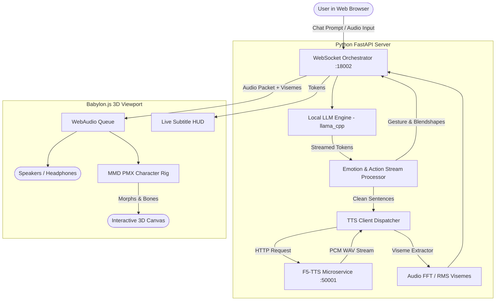

# Local AI Waifu (DLP3D)

<div align="center">


**A fully local, zero-cloud, ultra-low-latency 3D AI companion with MMD PMX physics, local GGUF LLM execution, zero-shot Flow-Matching voice cloning, and real-time lip synchronization.**

</div>

---

## 🌟 Overview

**Local AI Waifu (DLP3D)** is a production-grade, offline AI companion engine designed to run completely on consumer hardware (such as an NVIDIA RTX 4060 Laptop GPU). It pairs local LLM reasoning with real-time 3D animation and instant neural voice cloning, creating an expressive, lively companion that speaks, gestures, and reacts naturally without sending any data to cloud providers.

Built upon the open-source foundations of [**DLP3D (Digital Life Project 2)**](https://github.com/dlp3d-ai/dlp3d.ai), this project extends the system with dedicated MMD PMX physics, local GGUF models, F5-TTS zero-shot voice cloning, and biological motion synthesis.

---

## ✨ Key Features

### 1. 🎭 3D Avatar & Procedural Motion Engine
* **Hololive & MMD PMX Support**: Native rendering of high-fidelity MMD models (including Shiori Novella) powered by `babylon-mmd` and Babylon.js.
* **Physics & Secondary Motion**: Real-time rigid-body physics for hair, ribbons, clothing, and accessories.
* **Biological Motion System**: Procedural chest breathing, gentle contrapposto weight shifting, cervical dual-joint articulation, and natural eye saccades/auto-blinks.
* **Quaternion Delta Posing**: Calibrated feminine standing A-pose with relaxed finger curls, eliminating limb drift and awkward T-poses.
* **Pristine Eye Geometry**: Locked forward pupil focus with isolated eyelid/brow blendshapes, preventing unnatural eye-crossing or slit-eye distortions during smiles.

### 2. 🧠 Native Local LLM Integration
* **GGUF Execution via llama.cpp**: Direct GPU offloading of GGUF models (such as `Qwen3.5-4B-Q4_K_M.gguf`) generating tokens at **35–45 tokens/second**.
* **Zero Cloud Latency**: Completely self-contained; no API keys, cloud subscriptions, or telemetry required.
* **Smart Model Scanner**: Automatically scans local folders (including LM Studio, Ollama, and Odysseus model hubs).

### 3. 🎙️ Flow-Matching Zero-Shot Voice Cloning (F5-TTS)
* **Sub-Second Generation**: Generates 3-to-5-second speech sentences in **~0.3s to 0.6s** (Real-Time Factor: **0.09 – 0.14**) using F5-TTS Flow Matching.
* **Pristine Audio Quality**: Crisp 24kHz neural audio decoding powered by `Vocos`.
* **Zero Prompt Bleed**: Clean reference alignment ensuring prompt syllables never bleed into generated conversation.
* **Calm & Consistent Pitch**: Calibrated Classifier-Free Guidance (`CFG = 1.8`) and 12-step Euler integration, eliminating high-pitch squeaks, vocal fry, or mid-dialogue voice jumps.
* **Multi-Engine Support**: Supports **F5-TTS** (ultra-fast flow matching), **CosyVoice** (diffusion zero-shot), and **Edge-TTS** (zero-GPU fallback).

### 4. 👄 Real-Time Lip-Sync & Emotion Parser
* **Multi-Language Viseme Tracking**: Real-time amplitude and formant analysis mapped directly to Japanese MMD vowel blendshapes (`あ`, `い`, `う`, `え`, `お`) and GLB/VRM visemes.
* **Streaming Emotion & Action Extraction**: Parses bracketed emotion and gesture tags (`[happy]`, `[gesture:nod]`, `[blush]`, `[thinking]`) and non-verbal roleplay asterisks (`*giggles*`, `*smiles*`).
* **Emoji-to-Blendshape Mapping**: Automatically translates emojis (e.g. `😄`, `🤔`, `😳`) into facial blendshapes while stripping them from the audio stream to protect vocoder encoding.

### 5. 💡 Reactive HUD & Activity States
* **Live State Badges**:
  * 🟡 **Pondering...**: Pulsing beacon indicating LLM thought generation.
  * 🟢 **Speaking**: Animated 3-bar audio equalizer reflecting live speech cadence.
  * 🟢 **Finished**: Smooth transition to "Ready" status upon audio completion.
* **Instant Speech Interruption**: Submitting a new message instantly cancels ongoing audio playback and active buffers.

---

## 🏗️ Architecture



---

## 💻 Hardware Requirements

| Component | Minimum Specification | Tested & Recommended |
| :--- | :--- | :--- |
| **OS** | Windows 10/11 (64-bit) | Windows 11 (64-bit) |
| **GPU** | NVIDIA GPU with 6GB+ VRAM | **NVIDIA RTX 4060 Laptop (8GB VRAM)** |
| **CUDA** | CUDA 12.1+ | CUDA 12.1 / cuDNN 8.9 |
| **RAM** | 16 GB System Memory | 32 GB System Memory |
| **Storage** | 10 GB SSD free space | NVMe M.2 SSD |

---

## 🚀 Quick Start Guide

### 1. Clone the Repository
```powershell
git clone https://github.com/Phat-Hy/local-waifu-dlp3d.git
cd local-waifu-dlp3d
```

### 2. Environment Setup

#### Main Orchestrator Virtual Environment
```powershell
python -m venv venv
.\venv\Scripts\Activate.ps1
pip install -r requirements.txt
```

#### F5-TTS Service Setup (Dedicated Environment)
```powershell
cd services/f5-tts
python -m venv venv
.\venv\Scripts\Activate.ps1
pip install torch torchvision torchaudio --index-url https://download.pytorch.org/whl/cu121
pip install f5-tts fastapi uvicorn soundfile
cd ../..
```

Download the F5-TTS base checkpoint:
```powershell
python services/f5-tts/download_fast.py
```
*(Places `model_1250000.safetensors` in `services/f5-tts/checkpoints/`)*

### 3. Launching (1-Click Run)
Run the automated Windows PowerShell launcher:
```powershell
.\run.ps1
```
This script automatically:
1. Verifies and boots the **F5-TTS Engine** on `http://127.0.0.1:50001`.
2. Warms up the GPU CUDA kernels for zero-first-turn delay.
3. Launches the **Waifu Orchestrator** on `http://127.0.0.1:18002`.
4. Opens the interactive web client in your default browser.

---

## 📁 Project Structure

```text
local-waifu-dlp3d/
├── backend/                  # Core Python backend orchestrator
│   ├── config.py             # Config manager & JSON persistence
│   ├── emotion.py            # Emotion/gesture parser & sentence streamer
│   ├── llm.py                # llama.cpp GGUF local model interface
│   ├── server.py             # FastAPI WebSocket & REST routing
│   └── tts.py                # Unified TTS service (F5-TTS, CosyVoice, Edge-TTS)
├── frontend/                 # WebGL 3D client application
│   ├── app.js                # Babylon.js scene, MMD loading, and state machine
│   ├── index.html            # UI HUD, chat bar, and model hub drawer
│   └── style.css             # Glassmorphism dark-mode responsive theme
├── services/
│   ├── f5-tts/               # High-speed flow-matching TTS service
│   │   ├── server.py         # FastAPI inference microservice (:50001)
│   │   ├── benchmark.py      # Latency & RTF benchmark script
│   │   └── download_fast.py  # Multi-threaded checkpoint downloader
│   └── cosyvoice/            # CosyVoice diffusion voice cloning service (:50000)
├── voices/                   # Reference audio samples for voice cloning
│   └── shiori_reference_calm.wav # Calibrated clean voice prompt
├── run.ps1                   # 1-Click automated launcher
└── config.json               # Active runtime configuration
```

---

## ⚙️ Configuration Reference (`config.json`)

```json
{
  "server": {
    "host": "127.0.0.1",
    "port": 18002
  },
  "llm": {
    "active_model_path": "path/to/your/Qwen3.5-4B-Q4_K_M.gguf",
    "scan_directories": ["models", "path/to/other/hubs"],
    "n_ctx": 2048,
    "n_gpu_layers": -1,
    "temperature": 0.7
  },
  "tts": {
    "engine": "f5-tts",
    "active_voice_path": "voices/shiori_reference_calm.wav",
    "speed": 1.0
  },
  "avatar": {
    "character_file": "ShioriNovella/ShioriNovella.pmx",
    "enable_cloth_simulation": true
  }
}
```

---

## 🛠️ Troubleshooting & FAQ

#### 1. Why does the model ponder without responding?
Make sure the browser has WebSocket access to `ws://127.0.0.1:18002/ws/chat`. Check your browser developer tools console (`F12`) for any client-side errors.

#### 2. How do I change the character model or avatar?
Open **Settings & Model Hub** (`⚙️ Settings` button in top right). You can select scanned local models, switch voice references, or drag-and-drop any custom `.pmx` or `.glb` avatar directly into the viewport.

#### 3. How do I interrupt her when she's speaking?
Simply type a new message and press `Enter`. The client immediately terminates active WebAudio playback and clears queued speech packets.

---

## 🙏 Credits & Acknowledgements

This project stands on the shoulders of incredible open-source innovations. Heartfelt gratitude to the authors and maintainers of:

* **[dlp3d-ai/dlp3d.ai](https://github.com/dlp3d-ai/dlp3d.ai)** (Digital Life Project 2) — The architectural foundation for real-time 3D avatar embodiment, web client layout, and blendshape/viseme animation drivers.
* **[SWivid/F5-TTS](https://github.com/SWivid/F5-TTS)** — Non-autoregressive Flow Matching speech synthesis model that powers our real-time zero-shot voice cloning.
* **[noname0310/babylon-mmd](https://github.com/noname0310/babylon-mmd)** — MMD `.pmx` model loader, SDEF physics, and Japanese morph runtime for Babylon.js.
* **[FunAudioLLM/CosyVoice](https://github.com/FunAudioLLM/CosyVoice)** — Expressive multi-lingual voice synthesis framework.
* **[ggerganov/llama.cpp](https://github.com/ggerganov/llama.cpp)** / **[Ollama](https://ollama.ai)** — Ultra-fast local GGUF inference and quantization.
* **[Cover Corp / Hololive Production](https://hololivepro.com)** — Original character design and 3D MMD assets for Shiori Novella (used under Hololive Derivative Works Guidelines).

---

## 📄 License

This project is open-source and released under the [MIT License](LICENSE).
3D character models and voice assets belong to their respective copyright holders (Cover Corp / Hololive Production).
